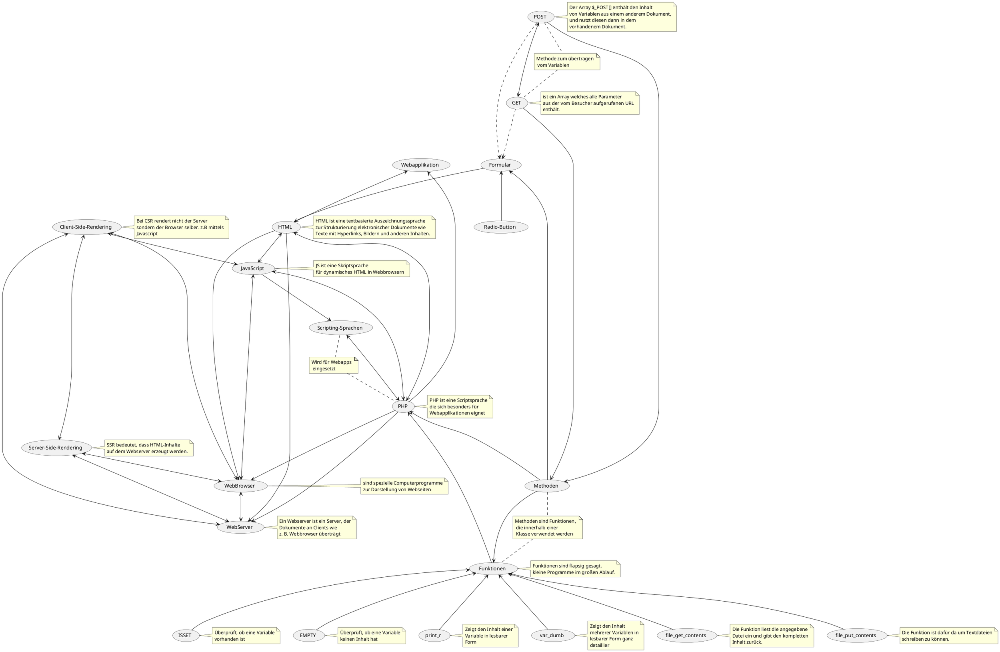

# Woche 2

```plantuml


@startuml

(Scripting-Sprachen) as (ScriptSprachen)
(PHP)
(HTML)
(Webapplikation) as (Web)
(Methoden)
(POST)
(GET)
(Formular)
(ISSET)
(EMPTY)
(print_r)
(var_dumb)
(Funktionen)

(Radio-Button)
(JavaScript)
(WebServer)
(WebBrowser)
(Client-Side-Rendering) as (CSR)
(Server-Side-Rendering) as (SSR)
(file_get_contents)
(file_put_contents)


(Web) <--- (PHP)
(Web) <--- (HTML)
(ScriptSprachen) <---> (PHP)
(PHP) <--> (HTML)
(Formular) ---> (HTML)
(PHP) <--- (Methoden)
(PHP) <--- (Funktionen)
(Funktionen) <--- (print_r)
(Funktionen) <--- (var_dumb)
(Funktionen) <--- (ISSET)
(Funktionen) <--- (EMPTY)
(Funktionen) <--- (file_get_contents)
(Funktionen) <--- (file_put_contents)
(Methoden) ---> (Funktionen)
(GET) ---> (Methoden)
(POST) ---> (Methoden)
(POST) <--> (GET)
(Formular) <--- (Methoden)
(Formular) <--- (Radio-Button)
(POST) ...> (Formular)
(GET) ...> (Formular)
(CSR) <--> (SSR)
(JavaScript) ---> (ScriptSprachen)
(CSR) <--> (WebBrowser)
(SSR) <--> (WebBrowser)
(CSR) <--> (WebServer)
(SSR) <--> (WebServer)
(WebBrowser) <--> (WebServer)
(CSR) <--> (JavaScript)
(HTML) <--> (JavaScript)
(PHP) <--> (JavaScript)
(HTML) ---> (WebServer)
(PHP) ---> (WebServer)
(HTML) ---> (WebBrowser)
(PHP) ---> (WebBrowser)
(JavaScript) <--> (WebBrowser)


note right of (HTML)
  HTML ist eine textbasierte Auszeichnungssprache
  zur Strukturierung elektronischer Dokumente wie
  Texte mit Hyperlinks, Bildern und anderen Inhalten.
end note

note right of (PHP)
 PHP ist eine Scriptsprache
 die sich besonders für
 Webapplikationen eignet
end note

note right of (ISSET)
Überprüft, ob eine Variable
vorhanden ist
end note

note right of (EMPTY)
Überprüft, ob eine Variable
keinen Inhalt hat
end note

note right of (print_r)
Zeigt den Inhalt einer
Variable in lesbarer
Form
end note

note right of (var_dumb)
Zeigt den Inhalt
mehrerer Variablen in
lesbarer Form ganz
detaillier
end note

note right of (Funktionen)
Funktionen sind flapsig gesagt,
kleine Programme im großen Ablauf.
end note

note right of (GET)
ist ein Array welches alle Parameter
aus der vom Besucher aufgerufenen URL
enthält.
end note

note right of (POST)
Der Array $_POST[] enthält den Inhalt
von Variablen aus einem anderem Dokument,
und nutzt diesen dann in dem
vorhandenem Dokument.
end note

note right of (file_get_contents)
Die Funktion liest die angegebene
Datei ein und gibt den kompletten
Inhalt zurück.
end note

note right of (file_put_contents)
Die Funktion ist dafür da um Textdateien
schreiben zu können.
end note

note right of (SSR)
SSR bedeutet, dass HTML-Inhalte
auf dem Webserver erzeugt werden.
end note

note right of (CSR)
Bei CSR rendert nicht der Server
sondern der Browser selber. z.B mittels
Javascript
end note

note right of (WebServer)
Ein Webserver ist ein Server, der
Dokumente an Clients wie
z. B. Webbrowser überträgt
end note

note right of (JavaScript)
JS ist eine Skriptsprache
für dynamisches HTML in Webbrowsern
end note

note right of (WebBrowser)
sind spezielle Computerprogramme
zur Darstellung von Webseiten
end note


note "Wird für Webapps \n eingesetzt" as NWebapps
(ScriptSprachen) .. NWebapps
NWebapps .. (PHP)


note "Methode zum übertragen \n vom Variablen" as Mpoge
(POST) .. Mpoge
Mpoge .. (GET)

note "Methoden sind Funktionen, \n die innerhalb einer \n Klasse verwendet werden" as nMethoden
(Methoden) .. nMethoden
nMethoden .. (Funktionen)

@enduml

```
