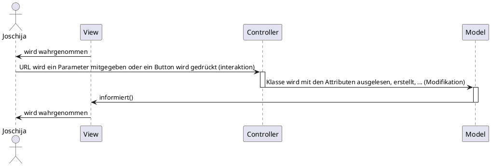

# Model View Controller


## Was ist MVC?
MVC steht für Model, View, Controller. Eine kurze Antwort auf die Frage, was unter den drei Begriffen verstanden wird, könnte wie folgt lauten:

__Model:__

Das Model ist verantwortlich für die Durchführung von Berechnungen. Es kapselt die Kern-Daten und -Funktionalität einer Applikation. (Als Bestandteil der Kern-Funktionalität stehen Methoden zur Manipulation der Daten zur Verfügung, welche durch einen Controller aufgerufen werden können. Weiterhin gibt es Methoden zur Lieferung von Daten welche die Views aufrufen können.) Das Model kennt keine konkreten Views und Controller, weiß also nicht wie, ob und wie oft es selber dargestellt werden wird.


__View:__

Die View ist verantwortlich für die Präsentation. Sie zeigt dem Anwender Informationen über das Model an, bereitet also die Daten des Model (oder Teile davon) in graphischer Darstellung auf. Eine View kennt immer genau ein Model. Falls sich Daten des Model ändern, so wird die View darüber vom Model benachrichtigt. Die View führt eine update-Methode aus, in der sie sich den aktuellen Datenzustand des Model holt(Methodenaufruf im Model) und ihre Darstellung sofort dementsprechend aktualisiert. 

__Controller:__

Der Controller ist verantwortlich für die Interaktion. Er definiert die Benutzerinteraktion der Applikation - er definiert die Reaktion der Benutzerschnittstelle auf die Eingabe. So nimmt er Benutzereingaben entgegen und bildet diese dann mit Hilfe der anderen Schichten auf Dienstanforderungen (Anzeigedienste der View oder datenverarbeitende Dienste des Model) ab. 

<br>

</img>

<br>

## Beispiel MVC

### Sequenzdiagramm




<br>
<br>

### Klassendiagramm

```plantuml
@StartUML Cardatabase


package controllers <<Folder>> {

  class Home{
      + index($name = '')

  }


  class contact{
      + index(): echo 'contact/index'
      + test($param1 = '', $param2 = ''): echo $param1 = '', $param2 = ''
  }
}


package core <<Folder>> {

  class Controller{
      # model($model): new $model()
      # view($view, $data = [])
  }

  class APP{
      # $controller = 'home';
      # $method = 'index';
      # $params = [];

      + __construct()
      + parseUrl()
  }
}


package models <<Folder>> {

  class User{
    + $name;
  }
}


package  views <<Folder>> {

  interface index{

  }

}

Home --|> Controller : extends
contact --|> Controller : extends
Controller ..> APP
User ..> Home
index ..> Controller


@enduml


```

<br>
<br>
<br>


#### Controller

```php

class Home extends Controller
{
    public function index($marke = '', $modell = '')
    {
        $car = $this->model('Car');
        $car->marke = $marke;
        $car->modell = $modell;

        $this->view('home/index', ['marke' => $car->marke,
                                    'modell' => $car->modell]);
    }
}

```

<br>

#### Model

```php
class Car{
    public $marke;
    public $modell;
}
```

<br>

#### View

```html
Marke:  <?=$data['marke']?> <br>
Modell: <?=$data['modell']?>
```

<br>

#### Browser
</img>