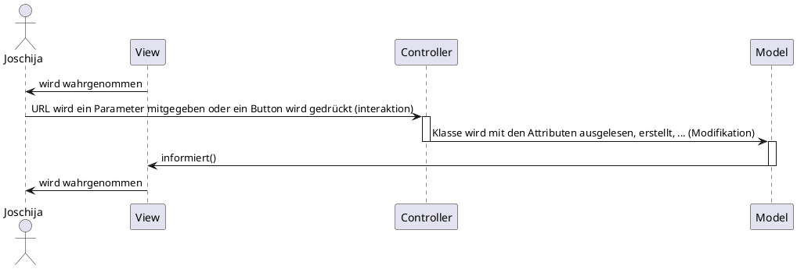

# Model View Controller


## Was ist MVC?
MVC steht für Model, View, Controller. Eine kurze Antwort auf die Frage, was unter den drei Begriffen verstanden wird, könnte wie folgt lauten:

__Model:__

Das Model hat die Aufgabe, die Webanwendung mit Daten aus der Datenbank (oder von wo auch immer) zu versorgen und die Daten, wenn gewünscht, zu speichern.

__View:__

Die View beinhaltet die Verwaltung der Templates, und generiert die HTML-Ausgabe.

__Controller:__

Der Kontroller entscheidet, was mit den übergebenen Parametern anzufangen ist, und steuert die Anwendung.

<br>

</img>

<br>

## Beispiel MVC

### Sequenzdiagramm




<br>
<br>

### Klassendiagramm

```plantuml
@StartUML Cardatabase


package controllers <<Folder>> {

  class Home{
      + index($name = '')

  }


  class contact{
      + index(): echo 'contact/index'
      + test($param1 = '', $param2 = ''): echo $param1 = '', $param2 = ''
  }
}


package core <<Folder>> {

  class Controller{
      # model($model): new $model()
      # view($view, $data = [])
  }

  class APP{
      # $controller = 'home';
      # $method = 'index';
      # $params = [];

      + __construct()
      + parseUrl()
  }
}


package models <<Folder>> {

  class User{
    + $name;
  }
}


package  views <<Folder>> {

  interface index{

  }

}

Home --|> Controller : extends
contact --|> Controller : extends
Controller ..> APP
User ..> Home
index ..> Controller


@enduml


```

<br>
<br>
<br>


#### Controller

```php

class Home extends Controller
{
    public function index($marke = '', $modell = '')
    {
        $car = $this->model('Car');
        $car->marke = $marke;
        $car->modell = $modell;

        $this->view('home/index', ['marke' => $car->marke,
                                    'modell' => $car->modell]);
    }
}

```

<br>

#### Model

```php
class Car{
    public $marke;
    public $modell;
}
```

<br>

#### View

```html
Marke:  <?=$data['marke']?> <br>
Modell: <?=$data['modell']?>
```

<br>

#### Browser
</img>