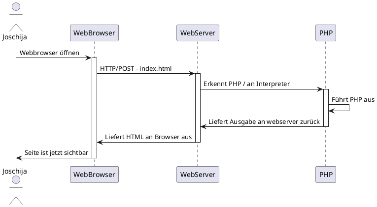
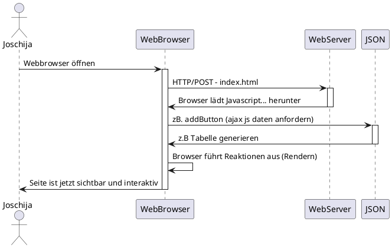

# SSR & CSR

## Server Side Rendering
Beim Server-seitigen Rendern werden die React-Komponenten auf dem Server gerendert. Die Ausgabe ist HTML-Inhalt. Das kann natürlich eine gewisse Geschwindigkeit bieten. Suchmaschinenoptimierte Seiten gehen deshalb lieber den SSR-Weg.

__Userfeeling:__ Das anfängliche Laden der Seite ist schneller als beim Client-seitigen Rendern. In Spitzenzeiten zahlreicher Anfragen leidet allerdings die Leistung der Website darunter. Geeignet eher für statische Seiten. 

 

### PlantUML

#### Vorteile:
- deutliche Leistungsverbesserung (bei kleineren Anwendungen)
- Suchmaschinenoptimierung
- Leistungsbeeinträchtigung bei größeren Anwendungen

#### Nachteile:
- Erhöhte Antwortzeiten in Spitzenzeiten
- Erhöhte Komplexität der Anwendung

 
 
 

## Client Side Rendering
Beim Client-seitigen Rendern lädt der Browser eine minimale HTML-Seite. Es rendert das JavaScript und füllt den Inhalt darin.

__Userfeeling:__ Nach dem anfänglichen, langsamen Laden ist der Rest des Website-Renderings schneller. Die anfängliche Ladezeit kann aber frustrierend sein. Geeignet eher für interaktive Webanwendungen mit mehr statischem Inhalt. 

 

### PlantUML

 

#### Vorteile:
- Schnelles Rendern der Website nach dem ersten Laden.
- Ideal für Webanwendungen.
- Robuste Auswahl an JavaScript-Bibliotheken.

#### Nachteile:
- Geringe SEO, wenn nicht richtig implementiert.
- Das anfängliche Laden erfordert möglicherweise mehr Zeit.
- In den meisten Fällen ist eine externe Bibliothek erforderlich.