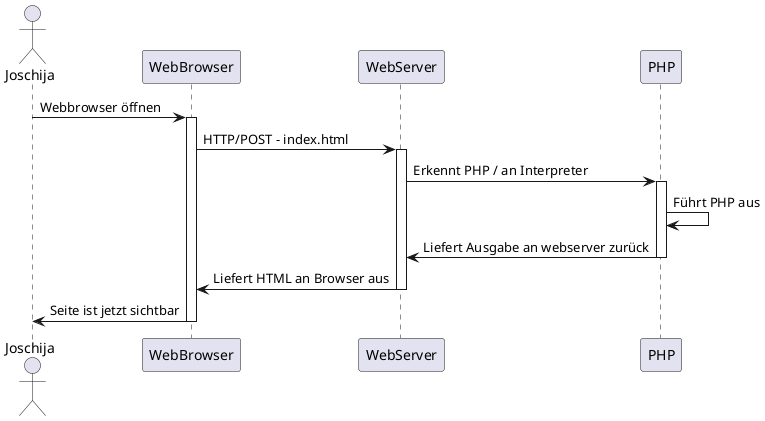
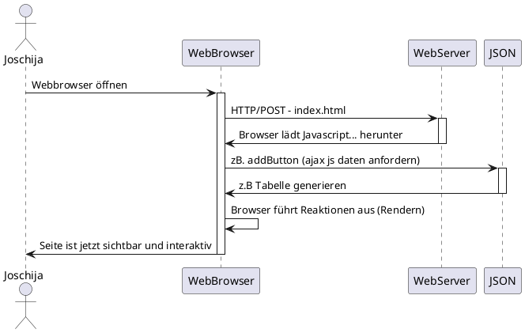

# SSR & CSR

## Server Side Rendering

### PlantUML

## Client Side Rendering

### PlantUML

 

#### Vorteile:
- Schnelles Rendern der Website nach dem ersten Laden.
- Ideal für Webanwendungen.
- Robuste Auswahl an JavaScript-Bibliotheken.

#### Nachteile:
- Geringe SEO, wenn nicht richtig implementiert.
- Das anfängliche Laden erfordert möglicherweise mehr Zeit.
- In den meisten Fällen ist eine externe Bibliothek erforderlich.