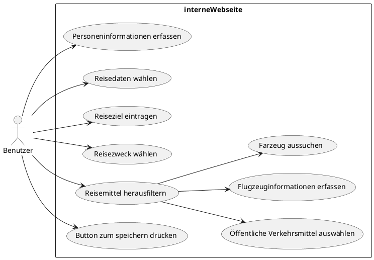

# Use-Case Diagramm

 

## Personeninformationen erfassen

 

| Name: | Personeninformationen erfassen | 
|----------------------------|-----------------------------------|
| __Nummer:__ | 01 |
| __Ziel im Kontext:__ | User erfasst seine Personeninformationen |
| __Akteure:__ | Benutzer |
| __Trigger:__ | Der Benutzer trägt seine eigene Personeninformationen   in ein online Resiseantrag Formular ein |
| __Vorbedingung:__ | Internetzugriff |
| __Essentielle Schritte:__ | 1. Der Benutzer öffnet die angegebene Webseite    2. Neue Reiseantrag eröffnen   3. Vorname eingeben   4. Nachname eingeben    |
| __Erweiterungen:__ |  3a. Der Vorname wird nicht eingegeben   3a1. Das Sytem merkt das kein Vorname eingegeben wurde   3a2. Das System gibt eine Fehlermeldung aus    4a. Der Nachname wird nicht eingegeben   4a1. Das Sytem merkt das kein Nachname eingegeben wurde   4a2. Das System gibt eine Fehlermeldung aus|
| __Kommentare:__ | ~ ||

 
 

## Reisedaten wählen 

 

| Name: | Reisedaten wählen  | 
|----------------------------|-----------------------------------|
| __Nummer:__ | 02 |
| __Ziel im Kontext:__ | User wählt die Reisedaten aus  |
| __Akteure:__ | Benutzer |
| __Trigger:__ | Der Benutzer trägt die Reisedaten in ein online Resiseantrag   Formular ein |
| __Vorbedingung:__ | User muss die genaue Reisedauer und wann er Abreisen will   kennen. |
| __Essentielle Schritte:__ | 1. Der Benutzer muss Personeninformationen eingeben    2. Abreise eintragen   3. Rückreise eingeben    |
| __Erweiterungen:__ |  2a. Das Abreisedatum wurde nicht ausgewählt   2a1. Das Sytem merkt das kein Abreisedatum gewählt wurde   2a2. Das System gibt eine Fehlermeldung aus     3a. Das Rückreisdatum wurde nicht ausgewählt   3a1. Das Sytem merkt das kein Rückreisdatum gewählt wurde   3a2. Das System gibt eine Fehlermeldung aus |
| __Kommentare:__ | ~ ||

 
 

## Reiseziel eintragen 

 

| Name: | Reiseziel eintragen | 
|----------------------------|-----------------------------------|
| __Nummer:__ | 03 |
| __Ziel im Kontext:__ | User erfasst sein Reiseziel |
| __Akteure:__ | Benutzer |
| __Trigger:__ | Der Benutzer trägt sein Reiseziel   in ein online Resiseantrag Formular ein |
| __Vorbedingung:__ | Kann eingereist werden |
| __Essentielle Schritte:__ | 1. Der Benutzer öffnet die angegebene Webseite    2. Neue Reiseantrag eröffnen   3. Vorname eingeben   4. Nachname eingeben    |
| __Erweiterungen:__ |  3a. Der Vorname wird nicht eingegeben   3a1. Das Sytem merkt das kein Vorname eingegeben wurde   3a2. Das System gibt eine Fehlermeldung aus    4a. Der Nachname wird nicht eingegeben   4a1. Das Sytem merkt das kein Nachname eingegeben wurde   4a2. Das System gibt eine Fehlermeldung aus|
| __Kommentare:__ | ~ ||

 
 

## Reisezweck wählen 

 

| Name: | Reisezweck wählen  | 
|----------------------------|-----------------------------------|
| __Nummer:__ | 04 |
| __Ziel im Kontext:__ | User erfasst seine Personeninformationen |
| __Akteure:__ | Benutzer |
| __Trigger:__ | Der Benutzer trägt seine eigene Personeninformationen   in ein online Resiseantrag Formular ein |
| __Vorbedingung:__ | Internetzugriff |
| __Essentielle Schritte:__ | 1. Der Benutzer öffnet die angegebene Webseite    2. Neue Reiseantrag eröffnen   3. Vorname eingeben   4. Nachname eingeben    |
| __Erweiterungen:__ |  3a. Der Vorname wird nicht eingegeben   3a1. Das Sytem merkt das kein Vorname eingegeben wurde   3a2. Das System gibt eine Fehlermeldung aus    4a. Der Nachname wird nicht eingegeben   4a1. Das Sytem merkt das kein Nachname eingegeben wurde   4a2. Das System gibt eine Fehlermeldung aus|
| __Kommentare:__ | ~ ||

 
 

## Reisemittel herausfiltern 

 

| Name: | Reisemittel herausfiltern  | 
|----------------------------|-----------------------------------|
| __Nummer:__ | 05 |
| __Ziel im Kontext:__ | User erfasst seine Personeninformationen |
| __Akteure:__ | Benutzer |
| __Trigger:__ | Der Benutzer trägt seine eigene Personeninformationen   in ein online Resiseantrag Formular ein |
| __Vorbedingung:__ | Internetzugriff |
| __Essentielle Schritte:__ | 1. Der Benutzer öffnet die angegebene Webseite    2. Neue Reiseantrag eröffnen   3. Vorname eingeben   4. Nachname eingeben    |
| __Erweiterungen:__ |  3a. Der Vorname wird nicht eingegeben   3a1. Das Sytem merkt das kein Vorname eingegeben wurde   3a2. Das System gibt eine Fehlermeldung aus    4a. Der Nachname wird nicht eingegeben   4a1. Das Sytem merkt das kein Nachname eingegeben wurde   4a2. Das System gibt eine Fehlermeldung aus|
| __Kommentare:__ | ~ ||

 
 

## Öffentliche Verkehrsmittel auswählen 

 

| Name: | Öffentliche Verkehrsmittel auswählen | 
|----------------------------|-----------------------------------|
| __Nummer:__ | 06 |
| __Ziel im Kontext:__ | User erfasst seine Personeninformationen |
| __Akteure:__ | Benutzer |
| __Trigger:__ | Der Benutzer trägt seine eigene Personeninformationen   in ein online Resiseantrag Formular ein |
| __Vorbedingung:__ | Internetzugriff |
| __Essentielle Schritte:__ | 1. Der Benutzer öffnet die angegebene Webseite    2. Neue Reiseantrag eröffnen   3. Vorname eingeben   4. Nachname eingeben    |
| __Erweiterungen:__ |  3a. Der Vorname wird nicht eingegeben   3a1. Das Sytem merkt das kein Vorname eingegeben wurde   3a2. Das System gibt eine Fehlermeldung aus    4a. Der Nachname wird nicht eingegeben   4a1. Das Sytem merkt das kein Nachname eingegeben wurde   4a2. Das System gibt eine Fehlermeldung aus|
| __Kommentare:__ | ~ ||

 
 

## Flugzeuginformationen erfassen 

 

| Name: | Flugzeuginformationen erfassen  | 
|----------------------------|-----------------------------------|
| __Nummer:__ | 07 |
| __Ziel im Kontext:__ | User erfasst seine Personeninformationen |
| __Akteure:__ | Benutzer |
| __Trigger:__ | Der Benutzer trägt seine eigene Personeninformationen   in ein online Resiseantrag Formular ein |
| __Vorbedingung:__ | Internetzugriff |
| __Essentielle Schritte:__ | 1. Der Benutzer öffnet die angegebene Webseite    2. Neue Reiseantrag eröffnen   3. Vorname eingeben   4. Nachname eingeben    |
| __Erweiterungen:__ |  3a. Der Vorname wird nicht eingegeben   3a1. Das Sytem merkt das kein Vorname eingegeben wurde   3a2. Das System gibt eine Fehlermeldung aus    4a. Der Nachname wird nicht eingegeben   4a1. Das Sytem merkt das kein Nachname eingegeben wurde   4a2. Das System gibt eine Fehlermeldung aus|
| __Kommentare:__ | ~ ||

 
 

## Farzeug aussuchen

 

| Name: | Farzeug aussuchen | 
|----------------------------|-----------------------------------|
| __Nummer:__ | 08 |
| __Ziel im Kontext:__ | User erfasst seine Personeninformationen |
| __Akteure:__ | Benutzer |
| __Trigger:__ | Der Benutzer trägt seine eigene Personeninformationen   in ein online Resiseantrag Formular ein |
| __Vorbedingung:__ | Internetzugriff |
| __Essentielle Schritte:__ | 1. Der Benutzer öffnet die angegebene Webseite    2. Neue Reiseantrag eröffnen   3. Vorname eingeben   4. Nachname eingeben    |
| __Erweiterungen:__ |  3a. Der Vorname wird nicht eingegeben   3a1. Das Sytem merkt das kein Vorname eingegeben wurde   3a2. Das System gibt eine Fehlermeldung aus    4a. Der Nachname wird nicht eingegeben   4a1. Das Sytem merkt das kein Nachname eingegeben wurde   4a2. Das System gibt eine Fehlermeldung aus|
| __Kommentare:__ | ~ ||

 
 
