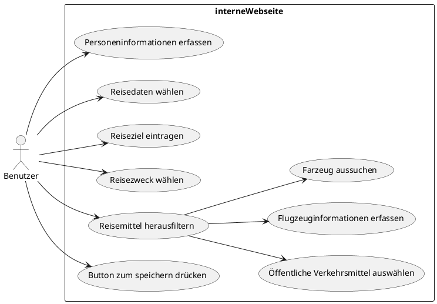

# Use-Case Diagramm

 
 

## Personeninformationen erfassen

 

| Name: | Personeninformationen erfassen | 
|----------------------------|-----------------------------------|
| __Nummer:__ | 01 |
| __Ziel im Kontext:__ | User erfasst seine Personeninformationen |
| __Akteure:__ | Benutzer |
| __Trigger:__ | Der Benutzer trägt seine eigene Personeninformationen   in ein online Resiseantrag Formular ein |
| __Vorbedingung:__ | Internetzugriff |
| __Essentielle Schritte:__ | 1. Der Benutzer öffnet die angegebene Webseite    2. Neue Reiseantrag eröffnen   3. Vorname eingeben   4. Nachname eingeben    |
| __Erweiterungen:__ |  3a. Der Vorname wird nicht eingegeben   3a1. Das Sytem merkt das kein Vorname eingegeben wurde   3a2. Das System gibt eine Fehlermeldung aus    4a. Der Nachname wird nicht eingegeben   4a1. Das Sytem merkt das kein Nachname eingegeben wurde   4a2. Das System gibt eine Fehlermeldung aus|
| __Kommentare:__ | ~ ||

[Funktionale Anforderungen](fallstudie/woche6.md#_1-personeninformationen-erfassen)

 
 

## Reisedaten wählen 

 

| Name: | Reisedaten wählen  | 
|----------------------------|-----------------------------------|
| __Nummer:__ | 02 |
| __Ziel im Kontext:__ | User wählt die Reisedaten aus  |
| __Akteure:__ | Benutzer |
| __Trigger:__ | Der Benutzer trägt die Reisedaten in ein online Resiseantrag   Formular ein |
| __Vorbedingung:__ | User muss die genaue Reisedauer und wann er Abreisen will   kennen. |
| __Essentielle Schritte:__ | 1. Der Benutzer muss Personeninformationen eingeben    2. Abreise eintragen   3. Rückreise eingeben    |
| __Erweiterungen:__ |  2a. Das Abreisedatum wurde nicht ausgewählt   2a1. Das Sytem merkt das kein Abreisedatum gewählt wurde   2a2. Das System gibt eine Fehlermeldung aus     3a. Das Rückreisdatum wurde nicht ausgewählt   3a1. Das Sytem merkt das kein Rückreisdatum gewählt wurde   3a2. Das System gibt eine Fehlermeldung aus |
| __Kommentare:__ | ~ ||

[Funktionale Anforderungen](fallstudie/woche6.md#_2-reisedaten-wählen)

 
 

## Reiseziel eintragen 

 

| Name: | Reiseziel eintragen | 
|----------------------------|-----------------------------------|
| __Nummer:__ | 03 |
| __Ziel im Kontext:__ | User erfasst sein Reiseziel |
| __Akteure:__ | Benutzer |
| __Trigger:__ | Der Benutzer trägt sein Reiseziel   in ein online Resiseantrag Formular ein |
| __Vorbedingung:__ | ~ |
| __Essentielle Schritte:__ | 1. Der Benutzer gibt sein Reseziel ein.     |
| __Erweiterungen:__ |  1a. Der Reiseziel wird nicht eingegebn   1a1. Das Sytem merkt das das Reiseziel nicht eingegeben wurde   1a2. Das System gibt eine Fehlermeldung aus   |
| __Kommentare:__ | ~ ||

[Funktionale Anforderungen](fallstudie/woche6.md#_3-reiseziel-eintragen)
 
 

## Reisezweck wählen 

 

| Name: | Reisezweck wählen  | 
|----------------------------|-----------------------------------|
| __Nummer:__ | 04 |
| __Ziel im Kontext:__ | User wählt sein Reisezweik aus |
| __Akteure:__ | Benutzer |
| __Trigger:__ | Der Benutzer trägt sein Reisezweck   in ein online Resiseantrag Formular ein |
| __Vorbedingung:__ | ~ |
| __Essentielle Schritte:__ | 1. Der Benutzer gibt sein Resezweck ein.     |
| __Erweiterungen:__ |  1a. Der Reisezweck wird nicht eingegebn   1a1. Das Sytem merkt das das Reisezweck nicht eingegeben wurde   1a2. Das System gibt eine Fehlermeldung aus   |
| __Kommentare:__ | ~ ||

[Funktionale Anforderungen](fallstudie/woche6.md#_4-reisezweck-wählen)
 
 

## Reisemittel herausfiltern 

 

| Name: | Reisemittel herausfiltern  | 
|----------------------------|-----------------------------------|
| __Nummer:__ | 05 |
| __Ziel im Kontext:__ | User sucht ein Reisemittel aus |
| __Akteure:__ | Benutzer |
| __Trigger:__ | Der Benutzer filtert sein gewünschtes Reisemittel   in ein online Resiseantrag Formular aus |
| __Vorbedingung:__ | ~ |
| __Essentielle Schritte:__ | 1. Der Benutzer wählt dur die Radiobox ein Reisemittel aus     |
| __Erweiterungen:__ |  1a. Der Reisemitttel wird nicht ausgesucht   1a1. Das Sytem merkt das kein Reisemitttel ausgesucht wurde   1a2. Das System gibt eine Fehlermeldung aus   |
| __Kommentare:__ | ~ ||

[Funktionale Anforderungen](fallstudie/woche6.md#_5-reisemittel-herausfiltern)
 
 

## Öffentliche Verkehrsmittel auswählen 

 

| Name: | Öffentliche Verkehrsmittel auswählen | 
|----------------------------|-----------------------------------|
| __Nummer:__ | 06 |
| __Ziel im Kontext:__ | User erfasst seine ÖV-informationen |
| __Akteure:__ | Benutzer |
| __Trigger:__ | Der Benutzer trägt seine eigene ÖV-informationen   in ein online Resiseantrag Formular ein |
| __Vorbedingung:__ | Bei Reisemittel ÖV ausgewählt |
| __Essentielle Schritte:__ | 1. Der Benutzer wählt bei Reisemittel ÖV aus    2. Der User trägt seine ÖV-informationen ein    |
| __Erweiterungen:__ |  2a. Die öv-informationen wurden nicht mitgegeben   2a1. Das Sytem merkt das kein Informationen eingetragen wurde   2a2. Das System gibt eine Fehlermeldung aus   |
| __Kommentare:__ | ~ ||

[Funktionale Anforderungen](fallstudie/woche6.md#_6-Öffentliche-verkehrsmittel-auswählen)

 
 

## Flugzeuginformationen erfassen 

 

| Name: | Flugzeuginformationen erfassen  | 
|----------------------------|-----------------------------------|
| __Nummer:__ | 07 |
| __Ziel im Kontext:__ | User erfasst seine Flugzeuginformationen |
| __Akteure:__ | Benutzer |
| __Trigger:__ | Der Benutzer trägt seine eigene Flugzeuginformationen   in ein online Resiseantrag Formular ein |
| __Vorbedingung:__ | Bei Reisemittel Flugzeug ausgewählt |
| __Essentielle Schritte:__ | 1. Der Benutzer wählt bei Reisemittel Flugzeug aus    2. Der User trägt seine Fluginformationen ein    |
| __Erweiterungen:__ |  2a. Die Flugzeuginformationen wurden nicht eingetragen   2a1. Das Sytem merkt das kein Informationen eingetragen wurde   2a2. Das System gibt eine Fehlermeldung aus   |
| __Kommentare:__ | ~ ||

[Funktionale Anforderungen](fallstudie/woche6.md#_7-flugzeuginformationen-erfassen)

 
 

## Farzeug aussuchen

 

| Name: | Farzeug aussuchen | 
|----------------------------|-----------------------------------|
| __Nummer:__ | 08 |
| __Ziel im Kontext:__ | User wählt ein Fahrzeug aus |
| __Akteure:__ | Benutzer |
| __Trigger:__ | Der Benutzer wählt ein Fahrzeug   in ein online Resiseantrag Formular aus |
| __Vorbedingung:__ | Bei Reisemittel Fahrzeug ausgewählt |
| __Essentielle Schritte:__ | 1. Der Benutzer wählt bei Reisemittel Fahrzeug aus    2. Der User wählt ein Fahrzeug    |
| __Erweiterungen:__ |  2a. Kein Fahrzeug wurde ausgesucht   2a1. Das Sytem merkt das kein Fahrzeug ausgesucht wurde   2a2. Das System gibt eine Fehlermeldung aus    2b. Das Fahrzeug ist nicht mehr Verfügbar   2b1. Das Sytem merkt das das Fahrzeug nicht mehr Verfügber ist   2b2. Das System gibt eine Fehlermeldung aus|
| __Kommentare:__ | ~ ||

[Funktionale Anforderungen](fallstudie/woche6.md#_8-farzeug-aussuchen)

 
 

## Button zum speichern drücken

 

| Name: | Button zum speichern drücken | 
|----------------------------|-----------------------------------|
| __Nummer:__ | 09 |
| __Ziel im Kontext:__ | User speichert die Daten vom Formular |
| __Akteure:__ | Benutzer |
| __Trigger:__ | Der Benutzer klickt auf den Button   und das Sytem speichert diese Daten in einer Datenbank |
| __Vorbedingung:__ | Ausgefühltes Formular |
| __Essentielle Schritte:__ | 1. Der Benutzer drückt Button    2. System überprüft ob alles ausgefühlt wurde   3. System speichert die Daten in einder Datenbank   |
| __Erweiterungen:__ |  2a. Das Formular wurde nicht ganz ausgefühlt   2a1. Das Sytem merkt das Daten Fehlen   2a2. Das System gibt eine Fehlermeldung aus  
| __Kommentare:__ | ~ ||

[Funktionale Anforderungen](fallstudie/woche6.md#_9-button-zum-speichern-drücken)

 
 