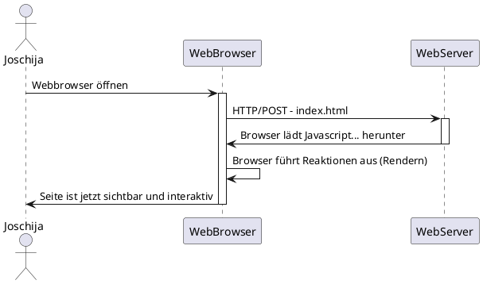

# Schulwoche 4
##### 31. August - 6. September

<br>
<br>
<br>


## Client Side Rendering


<br>
<br>
<br>
<br>

## PHP

### Dateien auslesen
Das file_get_contents () liest eine Datei in eine Zeichenfolge.
Diese Funktion ist die bevorzugte Methode, um den Inhalt einer Datei in eine Zeichenfolge einzulesen.

#### Beispiel

__TXT-File__
```txt
Hallo das ist ein Test
```

<br>

__PHP-FILE__

```PHP
$beispiel = file_get_contents('zitate.txt');
echo $beispiel;
```

<br>

__Ausgabe__
```
Hallo das ist ein Test
```

<br>
<br>

### Dateien schreiben
Um in Textdateien schreiben zu können, existiert in PHP die Funktion file_put_contents($filename, $data)

#### Beispiel

```PHP
$name = $_GET["name"];
$zeile = "Per GET wurde der Name $name übergeben \r\n";
file_put_contents("beispiel.txt", $zeile);
echo "beispiel.txt wurde überschrieben";
```

<br>
<br>
<br>
<br>

## Client Side Example

### Auftrag:
```
Erweitern Sie das CSR-Projekt um die Funktion, dass die dargestellten
Elemente aus einer Datei lesen kann
```

<br>

### Aufbau:
</img>

<br>

### einlesen.txt
```txt
Joschija, Gruss, Thomas, Graber
```

<br>

### api.php - funktion
```php
function response($response_code,$response_desc)
{   

    $namen = file_get_contents('einlesen.txt');
    $arrayn = explode(", " ,$namen);

    for($i=0;$i < count($arrayn); $i+=2){
        $response[$arrayn[$i]] = $arrayn[$i+1];
    }


    $response['response_code'] = $response_code;
	$response['response_desc'] = $response_desc;

    $json_response = json_encode($response);
    echo $json_response;
}
```

<br>

### Browser:
</img>
