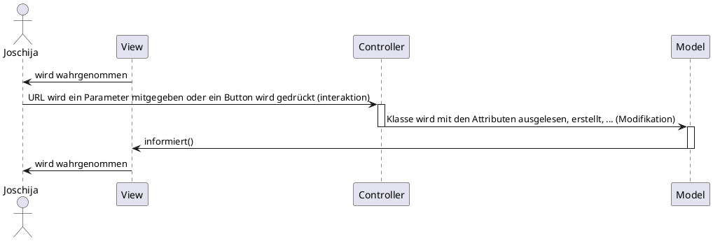

# Schulwoche 6
##### 14. September - 20. September

<br>
<br>
<br>

## Was haben wir gemacht?
Am Anfang der ersten Lektion konnten wir nochmals Fragen über das Obejkt orientiertes Programmieren stellen. Gerade nach den Fragen kam es zu den Präsentationen von den 4 Applikationsentwickler. Da Sie das ganze Model View Controller schon durchgemacht haben, konnten Sie uns erklären für was man das ganze braucht.

Damit wir sahen ob wir das ganze begriffen haben mussten wir den Ablauf mittels ein [Sequwnzdiagramm](#Sequenzdiagramm) aufzeigen.

Danach bekamen wir ein MVC Projektvorlage wo man ein [Klassendiagramm](#Klassendiagramm) erstellen mustten.

<br>

Als Hausaufgabe mussten wir ein eigenes Datenobject im MVC Project erstellen.
- [Controller](#Controller)
- [View](#View)
- [Model](#Model)
- [Browser](#Browser)


<br>
<br>
<br>

## Wie war es?
Der heutige Untericht war gut gestaltet und man musste genau aufpassen damit man mitkommt. Die Applikationsentwickler hatten eine gute und Verständliche Präsentation abgehalten.
Mit der Aufgabe vom Sequenzdiagramm und Klassendiagramm wurde das ganze noch viel verständlicher.

<br>
<br>
<br>

## Wie ist es mir ergangen?
Weil die Applis eine Präsentation über MVC gehalten haben kam ich besser in MVC draus, da ich letze Woche noch mühe hatte.

Probleme machte mir am Anfang das Sequenzdiagramm da ich den Ablauf noch nicht richtig verstanden habe. Ich musste ein bisschen recherieren, aber am Schluss hatte ich es trozdem geschaft.
Bei den MVC Hausaufgaben Fragte ich einen Mitarbeiter und er erklärte mir das ganze nocheinmal.

<br>
<br>
<br>

## Was habe ich gelernt?

### Sequenzdiagramm




<br>
<br>

### Klassendiagramm

```plantuml
@StartUML Cardatabase


package controllers <<Folder>> {

  class Home{
      + index($name = '')

  }


  class contact{
      + index(): echo 'contact/index'
      + test($param1 = '', $param2 = ''): echo $param1 = '', $param2 = ''
  }
}


package core <<Folder>> {

  class Controller{
      # model($model): new $model()
      # view($view, $data = [])
  }

  class APP{
      # $controller = 'home';
      # $method = 'index';
      # $params = [];

      + __construct()
      + parseUrl()
  }
}


package models <<Folder>> {

  class User{
    + $name;
  }
}


package  views <<Folder>> {

  interface index{

  }

}

Home --|> Controller : extends
contact --|> Controller : extends
Controller ..> APP
User ..> Home
index ..> Controller


@enduml


```

<br>
<br>
<br>

## Was ist noch offen?

Das Verständis hinter dem MVC!!

### MVC-Beispiel

#### Controller

```php

class Home extends Controller
{
    public function index($marke = '', $modell = '')
    {
        $car = $this->model('Car');
        $car->marke = $marke;
        $car->modell = $modell;

        $this->view('home/index', ['marke' => $car->marke,
                                    'modell' => $car->modell]);
    }
}

```

<br>

#### Model

```php
class Car{
    public $marke;
    public $modell;
}
```

<br>

#### View

```html
Marke:  <?=$data['marke']?> <br>
Modell: <?=$data['modell']?>
```

<br>

#### Browser
</img>
